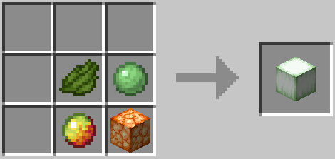

# VegAlts
VegAlts adds vegan paths for animal products, versions 1.13.2+.

Command | Permission | Description:

    - /va help | vegalts.help | Links to crafting guide.

## Crafting Guide

### Raw Beef

Description: 6 Red Mushroom, 1 Beetroot, 1 Wheat, and 1 of any seed type, in any order.

### Blaze Rod

Description: 6 Gunpowder, 2 Glowstone Dust, and 1 Iron Bars or Lightning Rod.

### Bone

Description: 3 Bone Meal in a line in any direction.

### Bone Meal

Description: 9 Apple, Beetroot, Carrot, Cocoa Beans, Fern, Large Fern, Dandelion, Poppy, Blue Orchid, Allium, Azure Bluet, Red Tulip, Orange Tulip, White Tulip, Pink Tulip, Oxeye Daisy, Brown Mushroom, Red Mushroom, Lily Pad, Melon, Mushroom Stew, Nether Wart, Potato, Pumpkin, Carved Pumpkin, Sea Pickle, Wheat, Baked Potato, Bread, Cookie, Hay Block, Red Mushroom Block, or Brown Mushroom Block, in any order. 

Note: Only available in 1.13.

### Raw Chicken

Description: 5 Brown Mushroom, 1 Wheat, and 2 of any seed type combination, in any order.

### Raw Cod

Description: 3 Brown Mushroom, 1 Wheat, 2 of any seed type combination, and 2 Kelp, in any order.

### Creeper Head

Description: 1 Skeleton Skull, 4 Gunpowder, and 4 Lime Dye.

### Dragon's Breath (3)

Description: 3 Glass Bottle, 1 End Crystal, and 5 Chorus Fruit, either in the order pictured or upside-down.

### Egg

Description: 1 Water Bottle, 1 Wheat, and 1 of any seed type, in any order.

Note: Fake Eggs do not hatch.

### Ender Pearl

Description: 1 Spider Eye, 4 Slimeball, and 4 Cyan Dye.

Note: Fake Ender Pearls do not spawn Endermites.

### Feather

Description: 1 Paper and 1 Stick, in any order.

### Ghast Tear

Description: 1 Iron Nugget or Gold Nugget and 8 Gunpowder.

### Glow Ink Sac

Description: 1 Ink Sac and 1 Glowstone Dust, in any order.

### Goat Horn

#### 1.19+:

Description: 1 Slimeball, 1 Disc Fragment, 1 Black Dye, and 1 Pointed Dripstone. 1 Gunpowder can be added for screaming-type Goat Horns. The Slimeball and Black Dye can be switched around.

#### Pre-1.19: (4)

Description: 1 Slimeball, 1 of any music disc, 1 Black Dye, and 1 Pointed Dripstone. 1 Gunpowder can be added for screaming-type Goat Horns. The Slimeball and Black Dye can be switched around.

### Gunpowder

Description: 1 Glowstone Dust, 1 Sand, and 1 Gravel, in any order. 

### Honey Bottle

Description: 1 Glass Bottle and 1 Honeycomb, in any order.

### Honeycomb

Description: 1 Water Bottle, 1 Sugar, 1 Paper, and 1 Orange Dye, in any order.

Note: Also returns a Glass Bottle.

### Ink Sac

Description: 1 Charcoal and 4 Kelp.

### Leather

Description: 1 Glass Bottle, 3 Apple, and 5 String.

Note: Also fills an empty bucket in inventory with water. If there is no empty bucket, returns as many Water Bottles as Leather crafted.

### Milk Bucket

Description: 1 Water Bucket and 8 of any seed type combination.

### Raw Mutton

Description: 5 Red Mushroom, 1 Beetroot, 1 Wheat, and 1 of any seed type, in any order.

### Nautilus Shell

Description: 1 Ink Sac, 4 Kelp, and 4 Scute, in the order pictured or rotated in any way.

### Nether Star

Description: 1 Conduit, 4 End Crystal, and 4 Soul Sand or Soul Soil.

### Nether Wart

Description: 1 of Red Mushroom, Brown Mushroom, Crimson Fungus, or Warped Fungus and 1 Blaze Powder, in any order.

### Ochre Froglight

Description: 1 Shroomlight, 1 Slimeball, 1 Magma Cream, and 1 Yellow Dye, in any order.

### Pearlescent Froglight

Description: 1 Shroomlight, 1 Slimeball, 1 Magma Cream, and 1 Purple Dye, in any order.

### Phantom Membrane (2)

Description: 5 Paper and 4 String.

### Piglin Head

Description: 1 Skeleton Skull and 8 Raw Porkchop.

### Player Head

Description: 1 Skeleton Skull and 8 Leather or Rabbit Hide.

### Porkchop

Description: 6 Brown Mushroom, 1 Beetroot, 1 Wheat, and 1 of any seed type, in any order.

### Pufferfish

Description: 1 Brown Mushroom, 1 Wheat, 1 Spider Eye, 2 of any seed type combination, and 4 Kelp, in any order.

### Rabbit

Description: 4 Brown Mushroom, 1 Wheat, and 2 of any seed type combination, in any order.

### Rabbit Hide

Description: 1 Glass Bottle, 1 Apple, and 3 String.

Note: Also fills an empty bucket in inventory with water. If there is no empty bucket, returns as many Water Bottles as Rabbit Hide crafted.

### Rabbit's Foot (2)

Description: 1 Rabbit Hide and 1 Bone, in any order.

### Rotten Flesh

Description: 1 Brown Mushroom or Red Mushroom, 1 Spider Eye, and 1 Bone Meal, in any order.

### Raw Salmon

Description: 4 Red Mushroom, 1 Beetroot, 1 Wheat, 1 of any seed type, and 2 Kelp, in any order.

### Scute

Description: 5 Kelp and 4 Bone, in the order pictured or upside-down.

### Shulker Shell

#### 1.17+

Description: 6 Amethyst Cluster and 2 End Rod.

#### Pre-1.17:

Description: 1 Purpur Block, 2 Purpur Pillar, 1 Purpur Slab, 2 Purpur Stairs, and 2 End Rod.

### Skeleton Skull

Description: 8 Bone.

### Slimeball

Description: 1 Water Bottle, 1 Wheat, 1 Sugar, 1 Clay Ball, and 1 Lime Dye, in any order.

### Spider Eye

Description: 2 Red Mushroom, 1 Beetroot, and 1 Poisonous Potato, in any order.

Note: Also returns a Potato.

### String

Description: 2-4 of Grass, Tall Grass, or Seagrass, in any order.

### Tropical Fish

Description: 1 Brown Mushroom, 1 Wheat, 1 Carrot, 1 of any seed type, and 2 Kelp, in any order.

### Verdant Froglight

Description: 1 Shroomlight, 1 Slimeball, 1 Magma Cream, and 1 Green Dye, in any order.

### Zombie Head

Description: 1 Skeleton Skull, 4 Rotten Flesh, and 4 Green Dye.

## Custom Fishing

Similar to vanilla fishing, each successful fish has an 85% chance for flora, 10% chance for junk, and 5% chance for treasure.

Individual item percentages are for the latest version. Individual item rates for older versions increase as items are removed.

### Flora
    7.41%:
        - Kelp
        - Seagrass
        - Grass
        - Lily Pad
        - Moss Carpet
        - Vine
        - Wheat Seeds
        - Pumpkin Seeds
        - Melon Seeds
        - Beetroot Seeds
        - Hanging Roots
        - Sugar Cane
    3.71%:
        - Sea Pickle
        - Random Dead Coral

### Junk
    
    10%:
        - Bowl
        - Stick
        - Charcoal
        - Flint
        - Clay Ball
    5%:
        - Compass
        - Brush
        - Flower Pot
        - Water Bucket
        - Prismarine Shard
        - Prismarine Crystals
        - Shears
        - Water Bottle
  

### Treasure

    13.64%:
        - Bottle o' Enchanting
        - Name Tag
        - Iron Nugget
        - Gold Nugget
        - Wet Sponge
        - Spyglass
        - 11, Far, Chirp, Blocks, Mall, Stal, Mellohi, Wait, Strad, or Ward Disc
    4.55%:
        - Totem of Undying

Note: Bamboo and Cocoa Beans fishing rates have vanilla behavior.

Global and per-player toggles information in `config.yml`.

## Miscellaneous

### Custom Archaeology

Suspicious blocks reveal Torchflower Seeds and Pitcher Pods instead of Coal and Sniffer Eggs.

Global and per-player toggles information in `config.yml`.

### Silverfish Spawning from Infested Blocks
Global and per-player toggles information in `config.yml`.